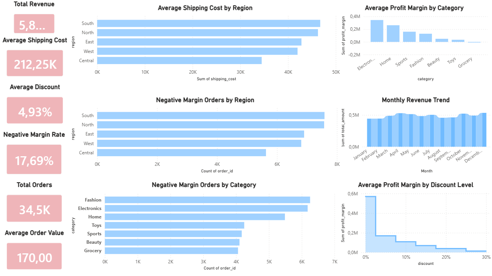

# DataTrust Monitor - SQL Data Quality & E-commerce Business Analysis

## Project Overview
DataTrust Monitor is a portfolio project focused on SQL-based data quality analysis and business issue detection in e-commerce transactions. The project combines Python, DuckDB SQL, Jupyter Notebook, Power BI, and GitHub to demonstrate how data checks can reveal not only technical issues, but also real business risks.

The project was designed to show stronger analytical depth than a standard dashboard project by combining data validation, SQL checks, KPI analysis, and business-focused visualisation.

## Business Objective
The goal of this project was to analyse e-commerce transaction data and identify:
- data quality issues
- negative-margin orders
- margin patterns by category and region
- discount impact on profitability
- business risks hidden inside transactional data

## Tools Used
- Python
- Pandas
- DuckDB SQL
- Jupyter Notebook
- Power BI
- GitHub

## Dataset
The dataset contains e-commerce transaction records with the following business fields:
- `order_id`
- `customer_id`
- `product_id`
- `category`
- `price`
- `discount`
- `quantity`
- `payment_method`
- `order_date`
- `delivery_time_days`
- `region`
- `returned`
- `total_amount`
- `shipping_cost`
- `profit_margin`
- `customer_age`

## Project Workflow
Raw CSV dataset → Python loading → data checks → numerical review → quality checks → DuckDB SQL analysis → KPI calculation → business issue detection → Power BI dashboard

---

## 1. Data Loading
The dataset was loaded into Jupyter Notebook using Pandas and reviewed to confirm that the file structure and columns were correct.

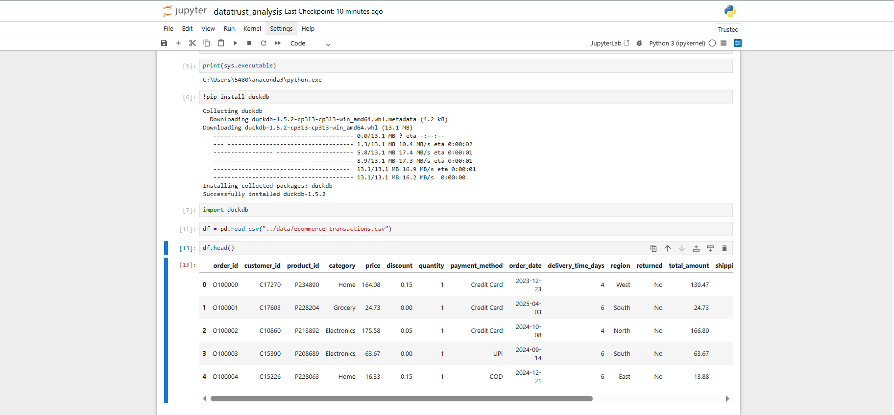

---

## 2. Data Structure Review
The dataset structure was checked using `df.info()` to review:
- number of rows
- column names
- data types
- completeness of the dataset

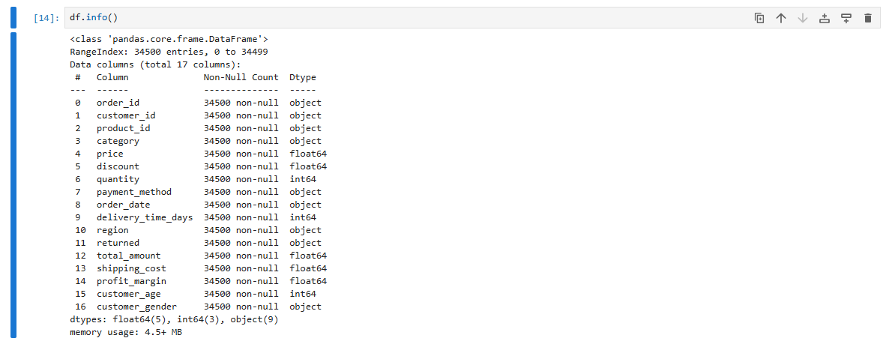

---

## 3. Missing Values Check
The dataset was checked for missing values to assess basic data quality.

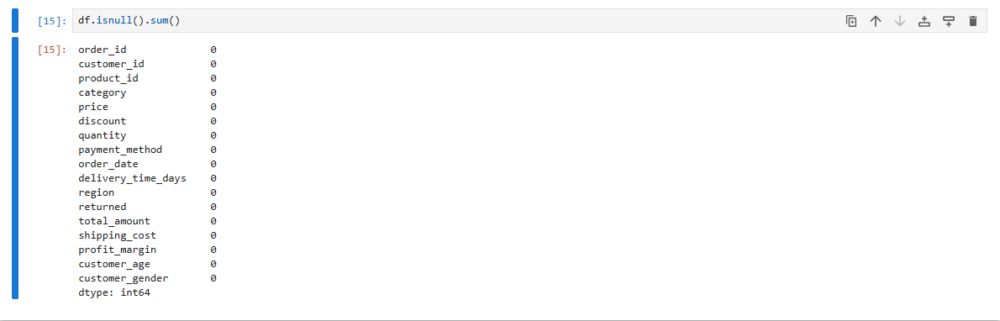

---

## 4. Numerical Review
A descriptive statistical summary was created for the main numerical columns:
- price
- discount
- quantity
- delivery_time_days
- total_amount
- shipping_cost
- profit_margin
- customer_age

This helped identify the distribution of values and detect possible anomalies.

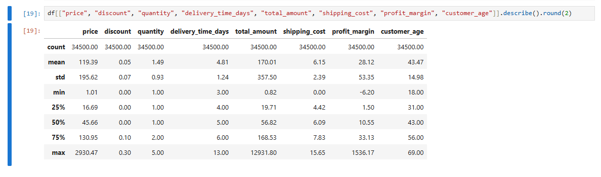

---

## 5. Data Quality Checks
A rule-based quality check was performed to identify invalid or suspicious values, including:
- negative price
- negative quantity
- negative total amount
- negative shipping cost
- negative profit margin
- discount above expected range
- invalid customer age
- negative delivery time

The checks showed that most technical fields were clean, but a significant number of records had negative profit margins.

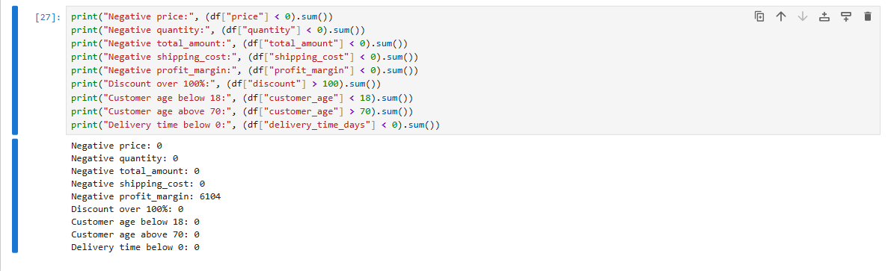

---

## 6. SQL Analysis - Loss Orders by Category
DuckDB SQL was used to analyse how negative-margin orders were distributed across product categories.

This step helped move the project beyond basic Python analysis and demonstrated SQL-based business investigation.

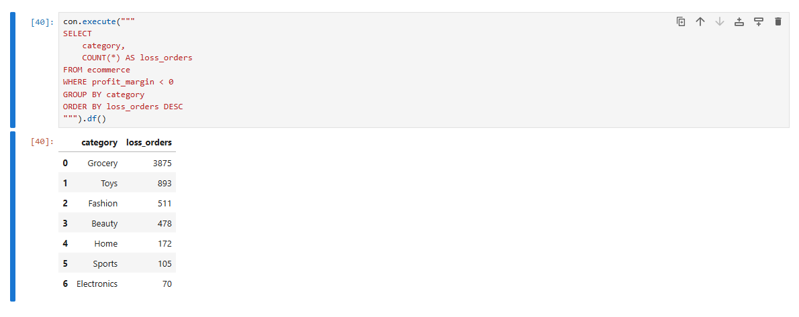

---

## 7. SQL Analysis - Region Margin Performance
A regional SQL analysis was performed to compare average profit margin and order volume across regions.

This helped identify which regions were weaker in terms of business efficiency.

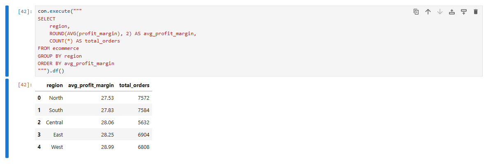

---

## 8. SQL Analysis - Category, Margin, and Discount
A category-level SQL query was used to combine:
- average profit margin
- average discount
- total number of orders

This allowed a more business-oriented comparison between categories and showed how discounting and margin performance interact.

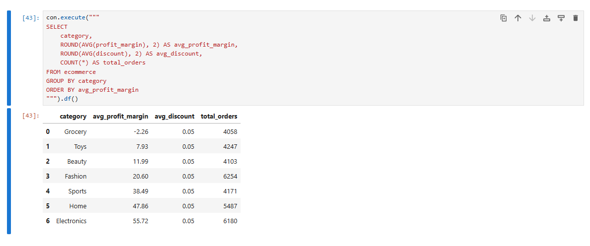

---

## 9. KPI Output
The main KPIs were calculated in Python to summarise the scale and performance of the dataset.

Key metrics included:
- Total Orders
- Total Revenue
- Average Order Value
- Average Discount
- Average Shipping Cost
- Negative Margin Rate

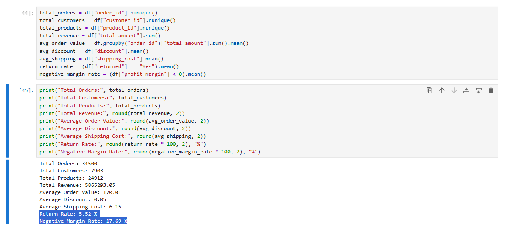

---

## 10. Negative Margin Orders by Category
A visual analysis was used to identify which categories generated the highest number of negative-margin orders.

This helped frame the core project finding as a business issue, not just a technical observation.

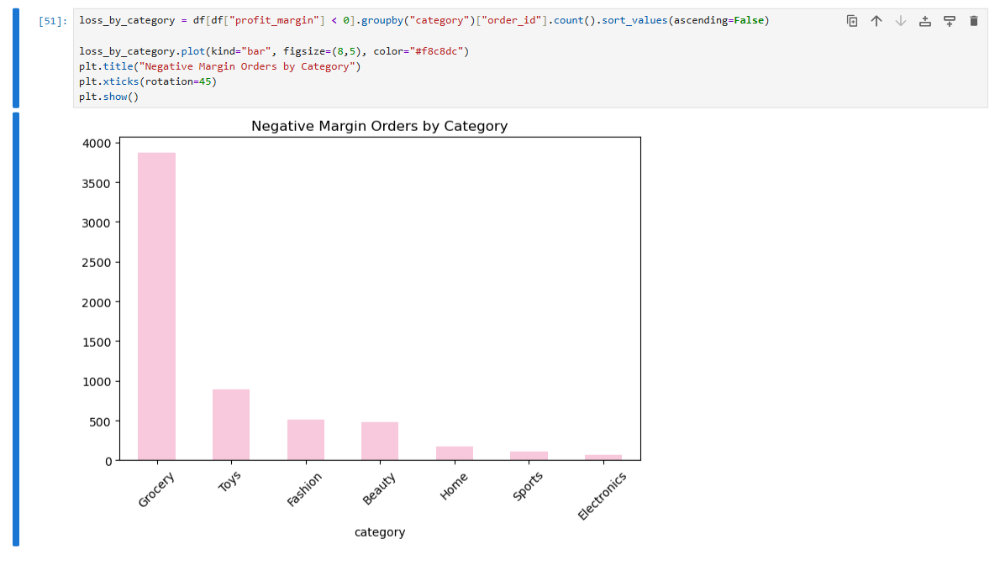

---

## 11. Average Profit Margin by Discount Level
A discount-level margin analysis was created to evaluate how discount intensity affects profitability.

This chart supports the conclusion that pricing and discount strategy can directly influence margin performance.

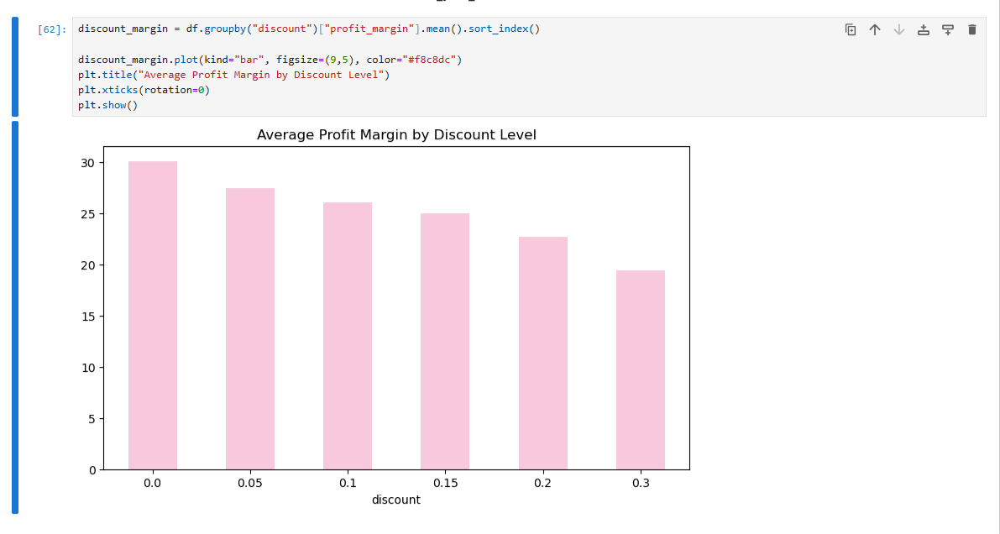

---

## 12. Power BI Dashboard
A final dashboard was built in Power BI to summarise the main findings in a business-friendly format.

The dashboard includes:
- KPI cards
- negative-margin order analysis
- regional margin patterns
- discount and profitability analysis
- overall commercial performance view


---

## Key Findings
Based on the analysis, the following conclusions were identified:

1. The dataset was mostly clean from a technical perspective, with no major issues in price, quantity, amount, shipping cost, age, or delivery time fields.
2. A substantial share of orders had negative profit margins, which indicates a business performance issue rather than a data corruption issue.
3. Loss-making orders were concentrated more heavily in specific categories.
4. Regional performance was uneven, with some regions showing weaker average profitability.
5. Discount levels were meaningfully related to profit margin performance.
6. SQL analysis added an extra professional layer to the project by validating findings through structured queries instead of relying only on Python.

---

## Business Value
This project demonstrates how data quality work can go beyond technical validation and uncover real business risks. It shows the ability to:
- validate structured datasets
- use SQL for analytical checks
- connect data quality results with business impact
- communicate findings through dashboarding

---

## Project Structure
```text
datatrust-monitor-sql-analysis/
│
├── data/
│   ├── ecommerce_transactions.csv
│   └── clean_ecommerce_transactions.csv
│
├── notebooks/
│   └── datatrust_analysis.ipynb
│
├── sql/
│
├── images/
│   ├── 01_df_head.png
│   ├── 02_df_info.png
│   ├── 03_null_check.png
│   ├── 04_numerical_review.png
│   ├── 05_quality_checks.png
│   ├── 06_sql_loss_by_category.png
│   ├── 07_sql_region_margin.png
│   ├── 08_sql_category_margin_discount.png
│   ├── 09_kpi_output.png
│   ├── 10_negative_margin_by_category.png
│   ├── 11_margin_by_discount.png
│   └── 12_dashboard_overview.png
│
├── dashboard/
│   └── datatrust_dashboard.pbix
│
└── README.md